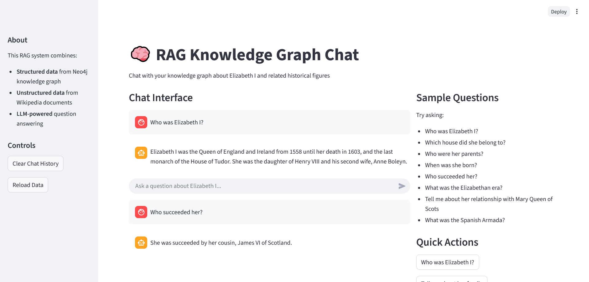

# RAG Knowledge Graph (compact)

A compact README for a small Retrieval-Augmented Generation (RAG) project that combines a document index with a lightweight knowledge graph and uses the GROQ LLM for generation.

Key points
- Uses the GROQ LLM for generation (set `GROQ_API_KEY` in your environment).
- Simple data pipeline in `data_pipeline/` and RAG logic in `rag_system/`.
- Streamlit UI available via `app.py`.

Quick setup (PowerShell)
```powershell
python -m venv env
.\env\Scripts\Activate.ps1
pip install --upgrade pip
pip install -r requirements.txt
```

Run
```powershell
streamlit run app.py
# or
python main.py
```

Configuration
- Set `GROQ_API_KEY` for the GROQ LLM provider.
- Optional: `GRAPH_DB_URL` for an external graph DB.

Example output



Notes
- Keep secrets out of source control. Use env vars or a local `config.py`.
- Extend `data_pipeline` to add new ingestion sources or replace the graph backend in `graph_client.py`.


